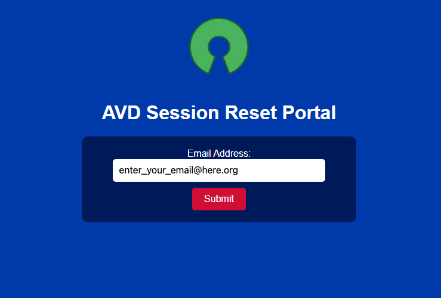
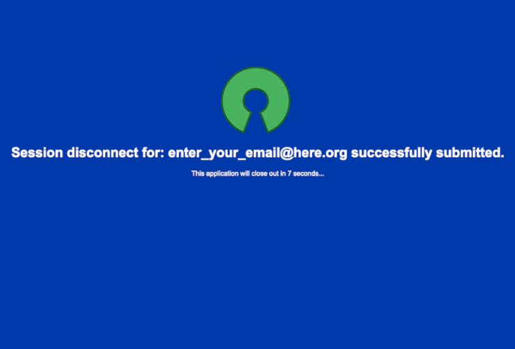

# Avd-session-reset-portal

### About:
* A simple self-serve portal that allows avd users to disconnect/logoff their stuck sessions  
* Runs as a remote app in avd  
* Currently only scoped to be used in azure gov cloud  

### Requirements:
* Host pool w/one windows 11 multi-session vm (2x8)
* Python 3.12.5 & git loaded on environment (win11)
* Managed identity with the following role assignment:
    * Desktop Virtualization Contributor
* Assignment of managed identity to host pool/vm(s) (user assigned)

### Setup:
* Download the setup script from [here](https://raw.githubusercontent.com/trespodnas/avd-session-reset-portal/refs/heads/main/setup/setup.ps1): 
  * Open up the script & change the following variables (lines 6-8):
  * $MANAGED_IDENTITY_CLIENT_ID = ""
  * $AZURE_SUBSCRIPTION_ID = ""
  * $AZURE_RESOURCE_GROUP_NAME = ""
* Add setup script to your build process or manually run on host(s) w/elevated privileges.

### TODO:
* further refinements for setup script
* error handling
* logging
* include commercial support

###### Application front page:

###### Application success page:

